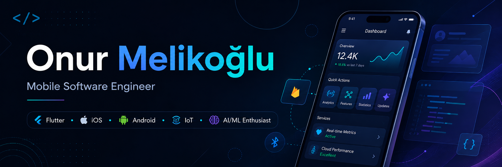
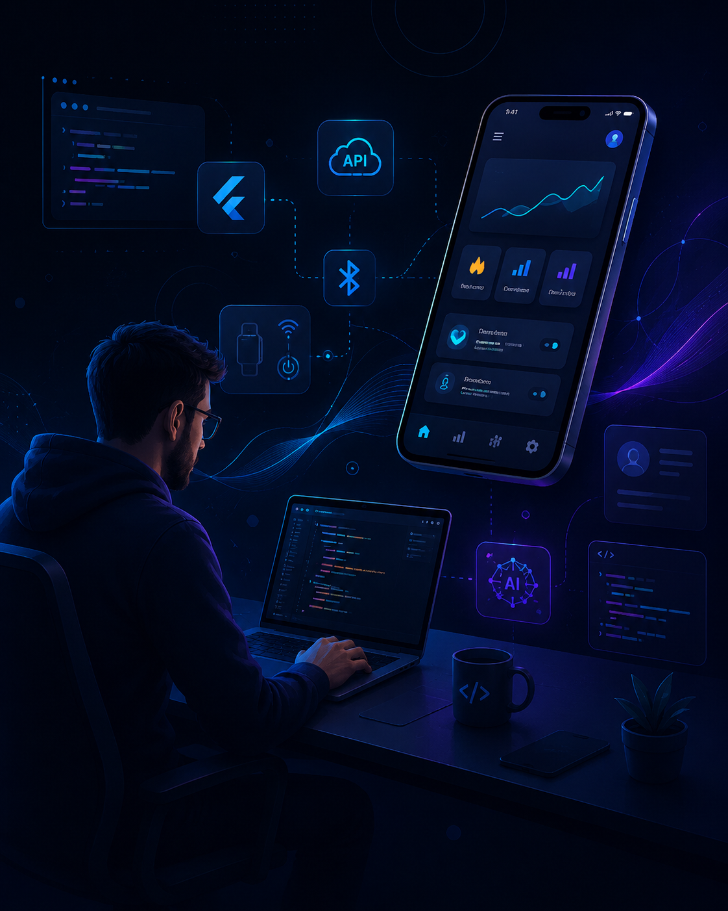

  

<h1 align="center">Hi 👋, I'm Onur Melikoğlu</h1>

<h3 align="center">
  Mobile Software Engineering Specialist from Türkiye
</h3>

  

  
  
  

---

## 👨‍💻 About Me

<table>
  <tr>
    <td width="72%" valign="top">

I am a **Mobile Application Development Specialist** focused on building scalable, maintainable and user-friendly mobile applications.

My main expertise is **Flutter & Dart**, but I also have experience with native mobile development, backend systems, API integrations, IoT/BLE communication and AI-assisted development workflows.

- 🚀 Building production-ready **Flutter mobile applications**
- 📱 Developing scalable **iOS & Android** experiences
- 🧩 Working with **Provider, MobX, GetX, BLoC, MVVM and Clean Architecture**
- 🔌 Experienced with **REST APIs, Firebase, Bluetooth/BLE and IoT integrations**
- 🤖 Interested in **AI-assisted development, prompt engineering and agentic coding workflows**
- 🛠️ Background in **Laravel, Angular, .NET and backend development**
- 🎯 Focused on clean architecture, reusable components and performance optimization

    </td>
    <td width="28%" align="center" valign="top">
      
    </td>
  </tr>
</table>

---

## 🧰 Tech Stack

### 📱 Mobile Development

  

### 🧠 State Management & Architecture

  
  
  
  
  
  

### 🔥 Backend, API & Cloud

  

  
  
  
  

### 🗄️ Database & Storage

  

### 🌐 Web & UI

  

### 🛠️ Tools & Workflow

  

  
  
  
  

---

## 📌 Featured Work Areas

<table>
  <tr>
    <td width="50%">
      <h3>💳 Payment Systems & Integrations</h3>
      

        Worked on payment system integrations including bank APIs, card payment flows,
        secure checkout experiences, and mobile payment solutions such as Apple Pay
        and Google Pay.
      

    </td>
    <td width="50%">
      <h3>🏦 FinTech Applications</h3>
      

        Developed and contributed to FinTech-oriented mobile applications involving
        digital wallets, transaction flows, financial data handling, user verification
        and secure mobile experiences.
      

    </td>
  </tr>

  <tr>
    <td width="50%">
      <h3>🤖 AI Assistants & Real-Time Chatbots</h3>
      

        Built chatbot features and AI assistant integrations inside mobile applications,
        including real-time messaging flows, conversational interfaces and AI-powered
        user support experiences.
      

    </td>
    <td width="50%">
      <h3>⛽ Fuel & Automation System Integrations</h3>
      

        Worked on mobile integrations for automation systems, especially fuel station
        automation flows, device communication, station operations and mobile-side
        control/monitoring experiences.
      

    </td>
  </tr>

  <tr>
    <td width="50%">
      <h3>🔌 IoT, BLE & Bluetooth Mesh</h3>
      

        Experienced with IoT communication technologies including Bluetooth, BLE,
        Bluetooth Mesh and mobile-to-device communication flows for connected
        hardware and industrial use cases.
      

    </td>
    <td width="50%">
      <h3>🧠 AI/ML & Computer Vision</h3>
      

        Worked with ONNX-based AI models and computer vision workflows, including
        camera-based object detection, on-device inference concepts and AI-powered
        mobile features.
      

    </td>
  </tr>

  <tr>
    <td width="50%">
      <h3>🔄 Serial Communication & Device Protocols</h3>
      

        Worked with serial communication protocols and device-level integrations,
        enabling mobile applications to communicate with external hardware,
        terminals and automation devices.
      

    </td>
    <td width="50%">
      <h3>📱 Mobile Product Engineering</h3>
      

        Designed and developed production-ready mobile features with clean
        architecture, scalable state management, API integrations, performance
        optimization and store release processes.
      

    </td>
  </tr>
</table>

---

## 📊 GitHub Stats

  
  

  

---

## ☕ A Little More

I enjoy building mobile products that are not only functional, but also clean, scalable and enjoyable to use.

My current focus is improving mobile architecture, creating better developer workflows with AI tools, and building applications that solve real-world problems.

---

  <b>Thanks for visiting my profile ✨</b>

